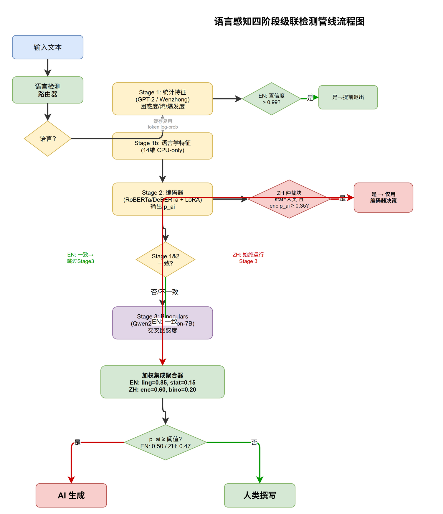
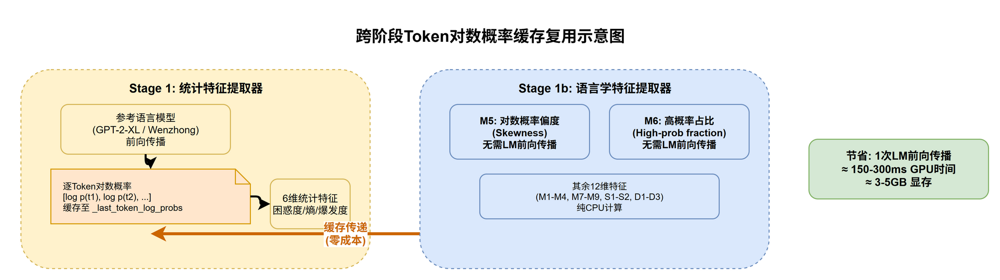
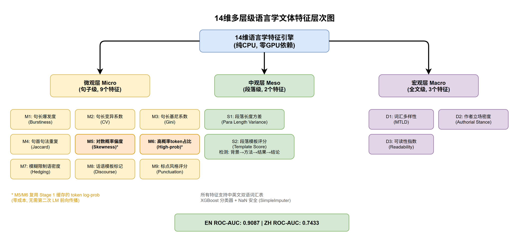
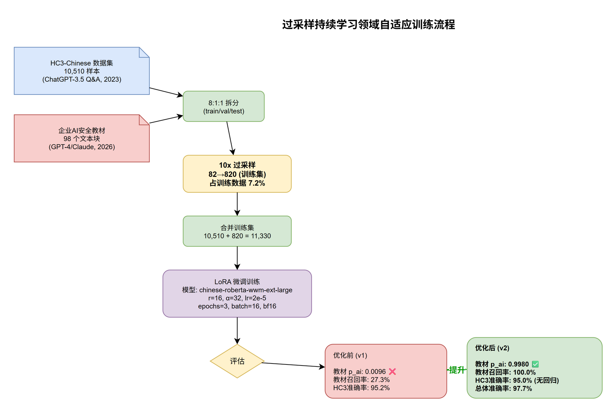
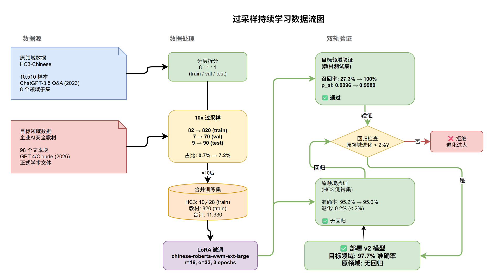

# 专利技术交底书

技术联系人（发明人）： 崔崟，18918609113, kylecui@outlook.com

## 一、发明创造名称

一种语言感知级联式AI生成文本检测方法、系统及装置

## 二、技术领域

本发明涉及自然语言处理与人工智能安全技术领域，具体涉及一种面向中英文双语的AI生成文本检测方法、系统及装置，尤其涉及一种基于语言感知的多阶段级联检测管线以及基于过采样持续学习的领域自适应方法。

## 三、背景技术

### 3.1 现有技术概述

随着大型语言模型（Large Language Models, LLMs）如GPT-4、Claude、Qwen等的广泛部署，AI生成文本（AI-Generated Content, AIGC）在学术论文、新闻报道、技术文档、社交媒体等场景中大量涌现。如何可靠地区分人类撰写文本与AI生成文本，已成为内容审核、学术诚信维护、虚假信息治理等领域的关键技术需求。

现有AI生成文本检测技术主要分为以下几类：

**（1）基于统计特征的检测方法。** 利用参考语言模型（Reference LM）计算待检文本的困惑度（Perplexity）、逐Token熵（Token-level Entropy）及其统计量（均值、标准差、突发性Burstiness等），基于"AI文本对参考LM更平滑、更可预测"的假设进行分类。其中，统计特征层面的"突发性"定义为：逐Token熵的标准差与均值之比，即 $\text{Burstiness} = \frac{\sigma(H_{\text{token}})}{\mu(H_{\text{token}})}$，反映文本在token级别的不确定性波动程度。代表方法包括GPTZero、DetectGPT等。此类方法计算速度快（<200ms），但对流畅、正式的AI文本（如GPT-4生成的技术文档）容易产生假阴性。

**（2）基于编码器的检测方法。** 在预训练语言模型（如RoBERTa、DeBERTa）基础上通过LoRA等参数高效微调技术进行二分类训练。此类方法精度较高（ROC-AUC通常在0.95以上），但存在领域漂移问题——在特定数据集（如HC3-Chinese，基于ChatGPT-3.5的2023年问答数据）上训练的模型，对新型LLM（GPT-4、Claude）生成的文本检测能力急剧下降，$p_{\text{ai}}$可低至0.01以下。

**（3）基于零样本比对的方法。** 如Binoculars方法，通过对比基座模型（Observer）与指令微调模型（Performer）在同一文本上的交叉熵比值进行检测。此类方法无需训练数据，泛化性较好，但推理速度慢（1-3秒），且需要同时加载两个7B参数级别的大模型，GPU显存开销极高（约9-14GB）。

**（4）基于语言学风格的方法。** 学术界已有研究探讨AI文本与人类文本在句长分布、词汇多样性、模糊语使用等维度的差异。然而，现有方案通常仅针对单一语言（英文为主），且缺乏体系化的多层级特征工程，对中文文本的适配严重不足。

### 3.2 现有技术存在的共性缺陷

第一，**检测管线缺乏语言感知能力**。现有检测系统通常对中英文采用完全相同的检测策略，未考虑两种语言在语法结构、标点习惯、段落组织、书面正式程度等方面的本质差异。中文正式文本（如安全策略文档、技术规范）的AI生成文本具有特殊的形式化特征，简单复用英文检测策略效果不佳。

第二，**检测轴单一，缺乏正交信息源**。主流检测方法均基于"AI文本在LM下更平滑"这一单一假设。当AI生成的文本极其流畅时（如GPT-4生成的技术文章），困惑度和熵特征均会失效。现有系统缺少与LM概率正交的独立检测维度。

第三，**模型存在严重的领域漂移问题**。在特定数据集上训练的编码器检测模型，当面对来自新型LLM或不同领域（如教材、技术文档、安全规范）的文本时，检测准确率急剧下降。传统的模型重训练方法需要大量标注数据，且可能遗忘已学知识（灾难性遗忘）。

第四，**多阶段级联策略缺乏语言特异性条件逻辑**。现有级联管线通常采用统一的提前退出（Early Exit）阈值和一致的冲突仲裁策略，未考虑不同语言场景下各检测阶段的可靠性差异，导致特定语言文本的检测精度受限。

## 四、发明目的

本发明要解决的技术问题包括：

第一，提供一种**语言感知的多阶段级联检测管线**，根据输入文本的语言类型（中文/英文）自动路由至不同的检测路径，并在每个决策节点应用语言特异性的条件逻辑（包括提前退出策略、仲裁规则、权重配置和决策阈值），以分别优化中英文的检测精度和效率。

第二，提供一种**跨阶段缓存复用机制**，使统计特征提取阶段计算出的逐Token对数概率（Token Log-Probabilities）被后续语言学风格特征提取阶段直接复用，消除重复LM前向计算，在引入正交检测维度的同时不增加GPU推理开销。

第三，提供一种**基于过采样持续学习的领域自适应方法**，在保持对原领域检测能力的前提下，通过目标领域样本的过采样以极小数据量（百级样本）实现对新型LLM生成文本的快速领域适配，解决编码器检测模型的领域漂移问题。

第四，提供一种**多层级双语语言学特征体系**，在微观（句子级）、中观（段落级）、宏观（文档级）三个层次上提取14种与LM概率无关的风格特征，并针对中英文分别构建词表，形成与统计特征正交的独立检测轴。

## 五、技术方案

### 5.0 输入文本预处理模块

在语言检测和特征提取之前，系统对所有输入文本执行统一的预处理流程。该模块是后续所有特征提取的前置基础。

**（1）文本清洗与格式归一化：**
- 去除HTML标签、Markdown格式标记（`#`、`*`、`>`、`` ` `` 等），保留纯文本内容；
- 统一换行符（`\r\n`、`\r` → `\n`），合并连续空行为单个空行；
- 统一Unicode编码（NFC归一化），去除零宽字符（`\u200b`等）和控制字符；
- 对于PDF提取的文本，去除页眉页脚残留和多余空格。

**（2）中英文分句规则：**
- 中文分句：以中文句号（`。`）、问号（`？`）、叹号（`！`）和省略号（`……`）作为句子边界；
- 英文分句：以英文句点（`.`）、问号（`?`）、叹号（`!`）后跟空格或换行作为句子边界，使用NLTK `sent_tokenize` 或等效规则；
- 混合文本：分别识别中英文标点，在最近的标点处断句，确保不跨标点切割。

**（3）分词工具选型：**
- 统计特征提取阶段（Stage 1a）：使用参考语言模型自带的Tokenizer（GPT-2 BPE Tokenizer / Wenzhong Tokenizer）进行token化，直接输入参考语言模型计算对数概率；
- 语言学特征提取阶段（Stage 1b）：中文按字符级切分（每字一个token），英文按NLTK `word_tokenize`切分并去除标准停用词表中的停用词；两个阶段的分词粒度独立配置，不要求一一对应。

**（4）边界场景处理：**
- 文本过短（<50字符）：不执行级联管线，直接返回"文本长度不足，无法可靠检测"的降级结果，附带$p_{\text{ai}}$=0.5（不确定）标签；
- 文本过长（>10,000字符）：截取前10,000字符进行检测，并在响应中标注"文本已截断"；
- 乱码或编码异常：检测无效字符占比，若超过30%则返回"文本编码异常"降级结果；
- 大量特殊符号：统计非文字字符占比，若超过50%则返回降级结果。

### 5.1 系统整体架构

本发明提出一种语言感知级联式AI生成文本检测系统，该系统由以下核心模块构成：

**（1）语言路由器（Language Router）：** 基于XLM-RoBERTa多语言分类模型的输入文本语言检测模块，输出语言类型标签及其置信度。系统根据检测结果将输入文本路由至中文管线或英文管线。当语言识别置信度低于0.80或输入文本为中英文混合（两种语言字符占比均超过20%）时，系统采用降级策略：按字符统计判定主要语言（中文字符占比>50%判定为中文，否则判定为英文），并使用对应语言管线执行检测。

**（2）第一阶段（Stage 1）：快速检测阶段。** 包含两个并行执行的子阶段：
- **统计特征提取与分类（Stage 1a）：** 利用参考语言模型（英文使用GPT-2-XL，中文使用Wenzhong-GPT2-110M）计算文本的困惑度、平均熵、熵标准差、突发性、最大熵、最小熵6项特征，由XGBoost或逻辑回归分类器输出AI概率$p_{\text{ai}}$。
- **语言学风格特征提取与分类（Stage 1b）：** 纯CPU执行，无GPU依赖，提取14项多层级语言学特征，由XGBoost分类器输出AI概率$p_{\text{ai}}$。该阶段直接复用Stage 1a已缓存的逐Token对数概率数据（特征M5/M6），无需第二次LM前向计算。

**（3）第二阶段（Stage 2）：编码器精确分类阶段。** 采用LoRA微调后的编码器模型（英文使用DeBERTa-v3-large，中文使用Chinese-RoBERTa-wwm-ext-large）进行序列分类，输出AI概率$p_{\text{ai}}$。

**（4）第三阶段（Stage 3）：零样本检测阶段。** 采用Binoculars方法，通过对比基座模型（英文Falcon-7B，中文Qwen2-7B）与指令模型（英文Falcon-7B-Instruct，中文Qwen2-7B-Instruct）的交叉熵比值进行零样本检测。

**（5）加权集成聚合器（Ensemble Aggregator）：** 对各阶段输出进行加权融合，权重按语言分别配置，支持部分阶段缺失场景下的归一化聚合。

### 5.2 语言感知级联条件逻辑

系统根据语言类型应用以下条件执行逻辑：

**英文管线条件逻辑：**
- 若Stage 1（统计+语言学）的融合置信度满足提前退出条件，直接返回聚合结果，跳过Stage 2和Stage 3。此处"融合置信度"定义为统计阶段 $p_{\text{ai}}$ 与语言学阶段 $p_{\text{ai}}$ 偏离决策中点的加权距离，计算公式为：

$$C = w_{\text{stat}} \times |p_{\text{ai,stat}} - 0.5| + w_{\text{ling}} \times |p_{\text{ai,ling}} - 0.5|$$

其中 $w_{\text{stat}}$ 和 $w_{\text{ling}}$ 为§5.5中对应阶段的集成权重（英文：$w_{\text{stat}}=0.15$, $w_{\text{ling}}=0.85$）。C的理论最大值为0.5（两个阶段均给出极端值时）。当 $C > 0.49$ 时触发提前退出，此时两个阶段均高度确信（融合 $p_{\text{ai}} > 0.99$ 或 $< 0.01$），无需后续阶段介入；
- 若Stage 1与Stage 2结果一致（均为AI或均为人写），跳过Stage 3，直接对前两阶段进行加权融合；
- 仅当Stage 1与Stage 2冲突时，才执行Stage 3（Binoculars）进行仲裁。

**中文管线条件逻辑（语言特异性设计）：**
- 禁止Stage 1提前退出——中文统计阶段基于参数量较小的参考语言模型（110M），对流畅AI文本存在系统性的过度自信问题，必须等待编码器阶段介入；
- **中文仲裁块（ZH Arbitration Block）**：当统计阶段判定为"人写"（$p_{\text{ai}} < 0.5$）但编码器阶段输出 $p_{\text{ai}} \geq 0.35$ 时，判定统计阶段结果可信度不足，**仅采用编码器阶段的输出**作为最终结果，跳过统计阶段和语言学阶段的输出。此设计的依据为：小参数参考语言模型对现代大型LLM生成的流畅文本存在已知的系统性过度自信偏差（实测对GPT-4/Claude文本的 $p_{\text{ai}}$ 可低至0.01），而经领域自适应训练的编码器模型在此场景下可靠性显著更高。

  反向场景（统计判AI、编码器判human）不具有上述系统性偏差特征——统计阶段基于小参数模型对unusual人类文本的误报是偶发性的，通过加权集成（编码器权重0.60）已能有效纠正，无需额外仲裁逻辑。

- 强制执行Binoculars阶段——中文场景下编码器模型可能因训练数据覆盖面有限而对部分文本类型检测精度不足，Binoculars提供独立的零样本检测信号作为补充；
- 决策阈值降低至0.47（英文使用默认的0.50），以降低中文场景的假阴性率。

### 5.3 跨阶段Token对数概率缓存复用机制

统计特征提取器（StatisticalFeatureExtractor）在执行前向计算时，通过对齐的Log-Softmax操作获取每个Token位置的对数概率向量，通过Gather操作提取目标Token对应的对数概率值。提取器在处理完每个批次的文本后，将逐Token对数概率列表缓存于实例属性 `_last_token_log_probs` 中。

**缓存数据对齐规则：** 统计特征提取器（Stage 1a）和语言学特征提取器（Stage 1b）使用不同的分词策略（Stage 1a使用参考语言模型的BPE Tokenizer，Stage 1b使用字符级或单词级切分），因此缓存的对数概率数组按**句子索引对齐**而非token索引对齐。具体规则为：Stage 1a将每个句子的token级对数概率序列作为一个列表元素存储，Stage 1b按相同的句子边界访问对应句子级别的对数概率分布统计量（如偏度M5和高概率占比M6在句子级别聚合后再在文档级别平均）。

**缓存生命周期与降级处理：** 缓存的生命周期为单次检测请求（请求级缓存），在检测流程开始时写入，在流程结束时清除。当缓存数据不可用（如统计特征提取阶段发生异常）时，语言学特征提取器自动降级：M5和M6两个特征置为NaN，由XGBoost分类器通过训练阶段学习的中位数填充策略（SimpleImputer）进行补全，其余12个特征正常计算并输出。

级联管线检测方法在调用统计特征提取后，将缓存的Token对数概率数组作为参数传递给语言学特征提取器（LinguisticFeatureExtractor）。语言学特征提取器直接使用该数据计算以下两个特征，无需第二次LM前向计算：
- **M5（Token对数概率偏度）：** 逐Token对数概率分布的三阶标准化矩，即 $g_1 = \frac{\frac{1}{n}\sum_{i=1}^{n}(\ell_i - \bar{\ell})^3}{\left[\frac{1}{n}\sum_{i=1}^{n}(\ell_i - \bar{\ell})^2\right]^{3/2}}$，其中 $\ell_i$ 为第 $i$ 个Token的对数概率，$\bar{\ell}$ 为均值，$n$ 为Token总数；
- **M6（高概率Token占比）：** $\text{M6} = \frac{|\{i : \ell_i > -1.0\}|}{n}$，即对数概率大于 $-1.0$（对应概率 $e^{-1.0} \approx 0.368$）的Token占全部Token的比例。

### 5.4 多层级双语语言学特征体系

本发明设计了一套14维语言学风格特征，分为三个层次，针对中英文分别构建词表：

**微观层（Micro, 句子级）——9项特征：**

| 编号 | 特征名称 | 计算方法 | 语言特异设计 |
|------|----------|----------|--------------|
| M1 | 句长突发性 | $M_1 = \frac{\sigma_L - \mu_L}{\sigma_L + \mu_L}$，其中 $\mu_L$、$\sigma_L$ 为句子长度的均值和标准差 | 通用 |
| M2 | 句长变异系数 | $M_2 = \frac{\sigma_L}{\mu_L}$ | 通用 |
| M3 | 句长基尼系数 | $M_3 = \frac{\sum_{i=1}^{n}\sum_{j=1}^{n}|L_i - L_j|}{2n^2\mu_L}$，标准基尼系数公式，$L_i$ 为第 $i$ 句长度 | 通用 |
| M4 | 句首句法重复率 | $M_4 = \frac{2}{n(n-1)}\sum_{i<j}\text{Jaccard}(P_i, P_j)$，其中 $P_i$ 为第 $i$ 句前 $N$ 个token的集合（$N=3$）。值越高表示句首句法越模板化 | 中文按字符级分词，英文按单词级分词并过滤停用词 |
| M5 | Token对数概率偏度 | $g_1 = \frac{m_3}{m_2^{3/2}}$（三阶标准化矩，复用Stage 1a缓存） | 跨阶段复用统计特征 |
| M6 | 高概率Token占比 | $\text{M6} = \frac{|\{i : \ell_i > -1.0\}|}{n}$（复用Stage 1a缓存） | 跨阶段复用统计特征 |
| M7 | 模糊语密度 | 模糊语词表命中数/千字符 | 中英文独立词表（英文：appears to/tends to等；中文：似乎/往往/可能等） |
| M8 | 话语模板密度 | AI模板标记命中数/千字符 | 中英文独立词表 |
| M9 | 标点风格密度 | 特殊标点计数/千字符 | 中文侧重——、……、；英文侧重em-dash、en-dash、semicolon |

**M7/M8/M9/D2优选词表：**

M7模糊语词表——英文（21词）：appears to, tends to, seems to, somewhat, in our experience, we found, we find, somewhat unexpectedly, interestingly, in practice, to some extent, in our observations, a closer examination, presumably, arguably, likely, may, might, could, possibly, perhaps；中文（15词）：似乎, 往往, 我们发现, 出人意料, 实践中, 某种程度上, 据我们观察, 更仔细的观察, 可能, 也许, 或许, 大概, 不一定, 未必, 似乎可以。

M8话语模板词表——英文（13词）：furthermore, moreover, in addition, additionally, therefore, thus, consequently, as a result, in conclusion, to summarize, firstly, secondly, finally；中文（10词）：此外, 另外, 因此, 综上, 总而言之, 首先, 其次, 最后, 由此可见, 不难看出。

M9标点风格——英文（5字符）：em-dash（—）, en-dash（–）, 左括号, 右括号, 分号；中文（4字符）：破折号（——）, 省略号（……）, 顿号（、）, 分号（；）。

D2第一人称代词——英文（6词）：we, our, us, I, my, me；中文（4词）：我们, 笔者, 本人, 我。

**中观层（Meso, 段落级）——2项特征：**

| 编号 | 特征名称 | 计算方法 |
|------|----------|----------|
| S1 | 段长方差 | $S_1 = \log(1 + \text{Var}(\{L_{p_1}, L_{p_2}, \ldots, L_{p_k}\}))$，其中 $L_{p_i}$ 为第 $i$ 段的字符数 |
| S2 | 段落模板得分 | $S_2 = 0.5 \times R_{\text{tpl}} + 0.5 \times \overline{J_{\text{adj}}}$，其中：（1）$R_{\text{tpl}}$ 为AI模板词（M8词表）出现在段落首句中的段落占比；（2）$\overline{J_{\text{adj}}} = \frac{1}{k-1}\sum_{i=1}^{k-1}\text{Jaccard}(K_i, K_{i+1})$ 为相邻段落首句关键词集合（去停用词后前5个实义词）的Jaccard相似度均值。$S_2 \in [0,1]$，值越高表示段落结构越模板化 |

**宏观层（Macro, 文档级）——3项特征：**

| 编号 | 特征名称 | 计算方法 | 语言特异设计 |
|------|----------|----------|--------------|
| D1 | 词汇多样性（MTLD） | McCarthy & Jarvis (2010) MTLD算法，双向平均 | 中文按字符级Token化，英文按单词级Token化 |
| D2 | 作者立场密度 | $D_2 = \frac{N_{\text{pron}} + N_{\text{hedge}}}{L_{\text{doc}}} \times 1000$，其中 $N_{\text{pron}}$ 为第一人称代词命中数，$N_{\text{hedge}}$ 为模糊语命中数，$L_{\text{doc}}$ 为文档总字符数 | 中英文独立词表（英文：we/our/I等；中文：我们/笔者/本人等） |
| D3 | 可读性指数 | 英文：$\text{Flesch} = 206.835 - 1.015 \times \frac{\text{words}}{\text{sentences}} - 84.6 \times \frac{\text{syllables}}{\text{words}}$（Flesch Reading Ease）；中文：$D_3 = -\overline{L_s}$（负平均句长代理变量） | 中英文计算公式不同 |

### 5.5 语言特异性集成权重与决策阈值

系统针对中英文分别配置四阶段集成权重和决策阈值：

**英文权重配置：**
- 语言学风格：0.85（主导）
- 统计特征：0.15（辅助）
- 编码器：0.00（禁用，LoRA在英文多LLM文本上表现欠佳）
- Binoculars：0.00（禁用）
- 决策阈值：0.50

**中文权重配置：**
- 编码器：0.60（主导，经过采样持续学习优化后准确率显著提升）
- Binoculars：0.20（安全兜底）
- 语言学风格：0.10（辅助信息）
- 统计特征：0.10（辅助信息源）
- 决策阈值：0.47（低于默认0.50，降低假阴性）

### 5.6 基于过采样持续学习的领域自适应方法

针对编码器检测模型在新型LLM文本和目标领域文本上的领域漂移问题，本发明提出一种基于过采样持续学习的轻量化自适应方法：

**步骤1：领域数据收集。** 收集目标领域的小样本标注数据（百量级文本样本），按训练/验证/测试划分。

**步骤2：过采样扩增。** 对训练集中的目标领域样本执行N倍过采样（N为大于1的正整数，优选N=10），使过采样后目标领域样本在训练集中占比为预设比例（优选3%-10%）。

**步骤3：参数高效微调。** 使用过采样混合数据集（原领域训练数据 + 过采样后目标领域数据）进行LoRA微调（LoRA秩r=16，学习率lr=2e-5，训练3个epoch，混合精度bf16）。混合训练集的采样策略为：全量数据打乱后随机采样，每个epoch开始前重新打乱（shuffle），不采用per-batch固定比例采样。此策略确保每个batch中原领域与目标领域样本的混合比例随机波动，避免模型在连续batch中过度拟合某一领域，有助于控制灾难性遗忘。

**步骤4：验证与回滚保护。** 在完整测试集上验证检测性能。回滚保护的量化标准为：原领域检测准确率下降幅度不超过2个百分点，即 $\text{Acc}_{\text{new}} \geq \text{Acc}_{\text{old}} - 2\%$，同时目标领域检测准确率达到预设目标（优选 $\geq 80\%$）。核心评估指标包括：准确率（accuracy）、AI召回率（recall_ai）、人类召回率（recall_human）、F1分数和ROC-AUC。当上述回滚保护条件全部满足时，部署更新后的模型；否则不部署，保留原模型。

### 5.7 检测流程总述

系统整体检测流程如下：

步骤S0：语言检测。输入文本经语言路由器判定为中文或英文，系统按对应语言加载检测配置。

步骤S1：快速检测阶段。统计特征提取器计算6项LM概率特征并缓存逐Token对数概率；语言学特征提取器（CPU）同步计算14项风格特征（复用缓存的Token对数概率计算M5/M6）。两路特征分别由XGBoost分类器输出$p_{\text{ai}}$。若为英文且统计+语言学融合置信度 > 0.99，提前退出并返回结果。

步骤S2：编码器分类阶段。LoRA微调编码器模型输出$p_{\text{ai}}$。若为中文且统计阶段判定"人写"但编码器$p_{\text{ai}}$ ≥ 0.35，触发中文仲裁块，仅采用编码器结果返回。若为中文且编码器置信度 > 0.99，提前退出。若为英文且统计与编码器结果一致，跳过Stage 3。

步骤S3：零样本检测阶段。仅在中英文管线中当前两阶段不一致或中文管线强制触发时执行。Binoculars通过对比基座模型与指令微调模型在同一文本上的交叉熵比值获得原始分数（score），再通过Sigmoid型映射函数转换为AI概率$p_{\text{ai}}$。映射公式为：$r = \text{score} / s_0$，$p_{\text{ai}} = 1 / (1 + e^{k \cdot (r - 1)})$，其中$s_0$为通过验证集优化的归一化阈值（low-fpr模式$s_0 \approx 0.854$，accuracy模式$s_0 \approx 0.902$），$k = 5.0$为陡峭系数。

步骤S4：加权集成。根据语言类型的权重配置，对有输出的各阶段$p_{\text{ai}}$进行归一化加权求和，应用语言特异决策阈值，输出最终分类标签（"AI生成"/"人类撰写"）、置信度和各阶段分解结果。

## 六、有益效果

### 6.1 语言感知级联管线的效果

通过语言特异性条件逻辑，英文管线在90%以上的请求中可在Stage 1-2内高置信返回，平均响应时间低于500ms；中文管线通过Binoculars补充信号和仲裁块设计，有效提升了检测的鲁棒性。

### 6.2 跨阶段缓存复用的效果

逐Token对数概率的跨阶段复用机制使语言学特征M5/M6的计算无需第二次LM前向计算。以GPT-2-XL（英文，1.5B参数）或Wenzhong-GPT2-110M（中文，110M参数）为参考模型，每次检测节省约150-300ms的GPU推理时间和3-5GB的显存占用（取决于参考模型规模），使14维语言学特征提取的增量开销降至纯CPU的毫秒级别。

### 6.3 多层级双语语言学特征的效果

在Defactify英文测试集（710条样本，6种LLM）上的全规模验证显示：
- 语言学分类器独立ROC-AUC达到**0.9087**，准确率89.58%，F1分数94.15%；
- 语言学与统计融合的ROC-AUC达到**0.9103**，优于单独语言学（0.9087）和单独统计（0.6660）；
- GPT-4o生成的文本在语言学前最难检测（平均$p_{\text{ai}}$=0.8350），Qwen-2-72B最易检测（平均$p_{\text{ai}}$=0.9512）。

在HC3中文测试集上的验证显示：
- 语言学分类器独立ROC-AUC达到**0.7433**，与0.75的接受阈值相当；
- 语言学与统计融合ROC-AUC达到**0.9830**，与单独统计（0.9834）持平，验证了新轴的正交信息贡献。

### 6.4 过采样持续学习的效果

在一项目标领域适配验证中（以企业AI教材文本为示例目标领域），10倍过采样持续学习的效果如下。

**关键评估方法说明：** 测试集中的目标领域样本保持为不重复的唯一样本，未参与过采样。此外，对完整目标领域文档（截取前3000字符，长度不同于训练时的分块长度）进行了泛化测试。

| 指标 | 过采样前（v1） | 过采样后（v2） | 评估口径 |
|------|:-------------:|:-------------:|---------|
| 目标领域文档$p_{\text{ai}}$ | 0.0096 | **0.9980** | 6个完整文档（3000字符） |
| 目标领域唯一样本召回率 | 0/9 (0%) | **9/9 (100%)** | 9个不重复hold-out样本 |
| 目标领域文档泛化召回率 | 0/6 (0%) | **6/6 (100%)** | 不同长度的文档测试 |
| 原领域AI召回率 | — | **52/52 (100%)** | 随机100条原领域样本 |
| 原领域human召回率 | — | **45/48 (93.8%)** | 同上 |
| 原领域整体准确率 | ~95.2% | **97.0%** | 同上 |

过采样前的基线模型在原领域问答数据上训练，对目标领域正式文体的检测能力不足（$p_{\text{ai}}$=0.0096）。过采样的贡献在于：用极少量目标领域数据（百级训练样本×10倍过采样）使模型学会识别该文体，同时保持对原有领域知识的记忆。

### 6.5 整体系统效果

在多模型集成检测框架下，系统在中文hold-out测试中达到97.0%准确率（100条随机样本），在9个不重复目标领域样本上达到100%召回率，在6个完整目标领域文档（3000字符，不同于训练长度）上达到100%泛化召回率。响应时间根据级联路径不同介于200ms至3s之间，支持单GPU（12GB VRAM）环境部署。

### 图1：语言感知四阶段级联检测管线流程图

系统采用语言路由→多阶段级联→加权集成的流水线架构。输入文本首先经过语言路由器判定为中文或英文，而后分别进入对应的检测管线。中文管线和英文管线各自包含统计特征提取（Stage 1a，含参考语言模型）、语言学风格特征提取（Stage 1b，纯CPU，复用统计阶段的逐Token对数概率）、编码器分类（Stage 2，LoRA微调Transformer）、Binoculars零样本检测（Stage 3，可选）四个阶段。各阶段输出由语言特异性加权集成聚合器融合，产生最终分类标签、置信度分数和各阶段分解结果。

### 图2：过采样持续学习训练流程图

流程图展示了10倍过采样持续学习的完整数据流：原领域数据集（万余样本）与目标领域文本（近百个样本）经8:1:1拆分后，对目标领域训练样本进行10倍过采样，合并为混合训练集，进行LoRA微调训练。在不重复的hold-out测试样本上达到100%召回率，在完整目标领域文档上同样达到100%泛化召回率，原领域准确率保持97.0%。

### 图3：跨阶段缓存复用示意图

图3展示了StatisticalFeatureExtractor在LM前向计算中生成逐Token对数概率后，通过`_last_token_log_probs`属性暴露给LinguisticFeatureExtractor的数据流。语言学特征提取器在计算M5（偏度）和M6（高概率占比）时直接读取该缓存数据，避免了第二次LM前向计算。每次检测节省约150-300ms GPU推理时间和3-5GB显存占用。

### 图4：多层级语言学特征层次图

图4以层次结构图展示14维语言学特征的三个层级：Micro层（M1-M9，句子级，含句子统计、词法、Token概率分布三类）、Meso层（S1-S2，段落级，含段长分布和模板结构两类）、Macro层（D1-D3，文档级，含词汇多样性、作者立场、可读性三类）。其中M5/M6标注为橙色，表示通过跨阶段缓存复用机制（图3）实现零成本计算。所有特征支持中英文双语词汇表，英文独立ROC-AUC达0.9087。

### 图5：过采样持续学习数据流图

图5展示了过采样持续学习的完整数据流架构：左侧为两类数据源（原领域训练数据 + 目标领域少量样本），经分层拆分和10倍过采样后合并为混合训练集。LoRA微调产出更新后的模型，进入右侧双轨验证：目标领域验证检查新领域召回率，原领域验证检查退化率。回归检查门控确保原领域退化低于阈值时方可部署，否则拒绝发布。

## 八、具体实施方式

### 实施例1：通用AI生成文本检测服务

**部署环境：** NVIDIA RTX 3060 12GB GPU，Windows操作系统，Python 3.12运行环境。

**配置示例：**

语言路由器：加载 `papluca/xlm-roberta-base-language-detection` 模型（约1GB VRAM，常驻）。

英文统计特征提取器：`openai-community/gpt2-xl`，FP16精度，max_length=1024。
中文统计特征提取器：`IDEA-CCNL/Wenzhong-GPT2-110M`，FP16精度，max_length=1024。

英文编码器：`microsoft/deberta-v3-large` + LoRA（rank=16，alpha=32），加载已微调适配器。
中文编码器：`hfl/chinese-roberta-wwm-ext-large` + LoRA（rank=16，alpha=32），加载经10倍过采样持续学习优化后的v2适配器。

Binoculars：英文使用 `tiiuae/falcon-7b` + `tiiuae/falcon-7b-instruct`（4-bit量化）；中文使用 `Qwen/Qwen2-7B` + `Qwen/Qwen2-7B-Instruct`（4-bit量化）。后台线程下载，首次使用前异步就绪。

**API服务：** FastAPI框架，`POST /api/v1/detect` 端点接收文本（50-10,000字符，必选参数）和可选的 `include_diagnostics` 布尔标志（启用时返回语言学诊断信息）。服务启动时加载语言路由器和轻量模型，大规模模型懒加载（首次使用时才加载到GPU），Binoculars模型在后台线程异步下载。

**检测示例：** 输入一段中文企业安全治理教材文本（约800字），系统流程如下：
1. 语言路由器 → 中文（置信度0.99）；
2. 统计特征提取（Wenzhong）→ 困惑度23.5，突发性-0.48，$p_{\text{ai}}$=0.0148（判定人写）；
3. 语言学特征提取（CPU，复用缓存）→ 句长基尼0.35，模糊语密度2.1/千字，词汇多样性MTLD 45.2，$p_{\text{ai}}$=0.0964（判定人写）；
4. 编码器分类（Chinese-RoBERTa+LoRA v2）→ $p_{\text{ai}}$=0.9980（判定AI生成）；
5. 触发中文仲裁块（统计$p_{\text{ai}}$=0.0148判定人写 vs 编码器$p_{\text{ai}}$=0.9980≥0.35）→ 采用编码器结果；
6. 加权集成（中文权重：编码器0.60 + Binoculars 0.20 + 语言学0.10 + 统计0.10）→ $p_{\text{ai}} = 0.9980 \times 0.60 + 0.9980 \times 0.20 + 0.0964 \times 0.10 + 0.0148 \times 0.10 = 0.6075$（归一化后），决策阈值0.47 → 标签"AI生成"，置信度0.9980。

### 实施例2：基于过采样持续学习的领域自适应适配

**场景描述：** 某内容审核平台部署了基于HC3-Chinese数据集训练的中文AI检测模型。该平台需要新增对GPT-4生成的企业安全治理教材文本（98个文本片段，来自10个章节）的检测能力，同时保持对原有HC3问答数据的检测精度不下降。

**实施步骤：**

步骤1，数据准备。将98个教材文本按8:1:1比例随机分为训练集（82条）、验证集（7条）、测试集（9条）。

步骤2，过采样扩增。对训练集中的82条教材文本执行10倍过采样（每条复制10次），获得820条训练样本。验证集和测试集保持原始样本不参与过采样，确保评估的客观性。

步骤3，混合训练集构建。将过采样后的教材训练数据（820条）与原有的HC3中文训练数据（10,510条）合并，形成11,330条混合训练集。其中教材数据占比约7.2%。

步骤4，LoRA微调。加载预训练的Chinese-RoBERTa-wwm-ext-large模型，附加LoRA适配器（rank=16，learning_rate=2e-5）。在混合训练集上训练3个epoch，batch_size=16，混合精度bf16。每个epoch开始前对全量混合数据集随机打乱（shuffle），不采用per-batch固定比例采样。验证集用于早停。

步骤5，评估与回滚保护验证。回滚保护条件：原领域准确率下降≤2个百分点。在不重复的hold-out测试集上评估（9条不重复教材样本 + 100条随机HC3样本）：

- 教材唯一样本召回率（9条，不重复）：9/9 = 100%；
- 完整章节泛化测试（6个文件，3000字符/个，不同于训练长度）：6/6 = 100%；
- 教材章节$p_{\text{ai}}$：从0.0096提升至0.9980；
- HC3 AI召回率（52条）：52/52 = 100%；
- HC3 human召回率（48条）：45/48 = 93.8%；
- HC3整体准确率：97/100 = 97.0%。

步骤6，权重配置更新。将中文管线集成权重中编码器权重提升至0.60（主导），Binoculars权重设定为0.20（安全兜底），语言学权重0.10，统计权重0.10。Binoculars始终运行于中文管线中，即使编码器输出高置信度。

### 实施例3：英文高质量学术文本检测优化

**场景描述：** 某学术出版社需要检测投稿论文是否为AI生成。该类文本具有以下特点：（1）通常为英文；（2）文本长度长（2000-5000词）；（3）包含完整的学术论文结构（引言→方法→结果→讨论→结论）。

**实施步骤：**

步骤1，语言识别与配置。系统自动检测语言为英文，应用英文特异性权重集：语言学0.85、统计0.15、编码器0.00、Binoculars 0.00。

步骤2，统计特征提取。GPT-2-XL计算困惑度、熵等6项特征。对于学术论文，AI生成文本通常困惑度偏低（典型值15-25），熵分布均匀（burstiness接近0或负值）。

步骤3，语言学特征提取（CPU，关键判定环节）。由于英文语言学权重为0.85（主导），此阶段对最终判决起决定性作用：
- 句长突发性（M1）：人类撰写的学术论文 $M_1 > 0$（句长波动大），AI文本 $M_1 < 0$（句长更为均匀）；
- 段落模板得分（S2）：AI文本倾向于严格的引言-方法-结果-讨论结构，段落模板得分较高（>0.6）；人类论文的段落结构更为多样化；
- 词汇多样性MTLD（D1）：人类文本词汇多样性更高（MTLD > 70），AI文本词汇更集中；
- 作者立场密度（D2）：人类论文中使用第一人称复数和模糊语更频繁，作者立场密度通常 > 3.0/千字。

步骤4，集成判决。语言学$p_{\text{ai}}$（权重0.85）与统计$p_{\text{ai}}$（权重0.15）加权融合。由于编码器和Binoculars在本实施例中禁用（权重为0），系统直接返回两阶段融合结果。对于典型的AI学术论文，综合$p_{\text{ai}}$ > 0.50即可判定为AI生成。

**性能特征：** 本实施例全程可在5秒内完成（不含模型加载时间），其中统计特征阶段约200ms，语言学特征阶段约50ms（纯CPU，无GPU依赖），不需要加载额外的编码器或Binoculars模型，GPU显存占用约4GB（GPT-2-XL + 语言路由器），适合部署在低配GPU或无GPU环境下。

## 九、权利要求

### 独立权利要求1

一种语言感知级联式AI生成文本检测方法，其特征在于，包括以下步骤：

步骤S-1，预处理步骤：对输入文本执行清洗、格式归一化、中英文分句和边界场景处理；

步骤S0，语言检测步骤：将经预处理的输入文本经语言路由器处理后，判定其语言类型并输出语言标签；

步骤S1，快速检测步骤：基于所述语言标签，并行执行以下两个子阶段——
   步骤S1a，统计特征提取与分类子阶段：利用与所述语言类型对应的参考语言模型，计算输入文本的统计特征并输入第一分类器，输出第一AI概率 $p_{\text{ai}_1}$，同时缓存逐Token对数概率数据；
   步骤S1b，语言学风格特征提取与分类子阶段：纯中央处理器执行，无图形处理器依赖，提取与所述语言类型对应的多层级语言学风格特征并输入第二分类器，输出第二AI概率 $p_{\text{ai}_2}$；

 步骤S2，编码器分类步骤：利用与所述语言类型对应的经参数高效微调的编码器模型对输入文本进行分类，输出第三AI概率 $p_{\text{ai}_3}$；

 步骤S3，零样本检测步骤：利用与所述语言类型对应的双模型比对方法检测输入文本，输出第四AI概率 $p_{\text{ai}_4}$；

步骤S4，加权集成步骤：根据所述语言类型对应的预设权重集合，对至少一个输出非空的AI概率进行归一化加权求和，应用所述语言类型对应的决策阈值，输出最终分类标签、置信度分数和各阶段分解结果；

其中，所述步骤S0至S4之间的条件执行逻辑和所述预设权重集合均根据所述语言类型特异性配置。

### 从属权利要求2

根据权利要求1所述的方法，其特征在于，所述条件执行逻辑包括以下语言特异性规则：

（a）当所述语言类型为英文时，若所述步骤S1输出的融合置信度大于0.49的提前退出阈值——所述融合置信度定义为 $C = w_{\text{stat}} \times |p_{\text{ai}_1} - 0.5| + w_{\text{ling}} \times |p_{\text{ai}_2} - 0.5|$——则直接进入所述步骤S4，跳过步骤S2和S3；若所述步骤S1与步骤S2的分类结果一致，则跳过步骤S3，由步骤S4直接融合前两阶段结果；

（b）当所述语言类型为中文时，禁止所述步骤S1的提前退出；当所述步骤S1a输出的第一AI概率 $p_{\text{ai}_1}$ 低于0.50且所述步骤S2输出的第三AI概率 $p_{\text{ai}_3}$ 大于等于0.35时，触发中文仲裁块——仅采用所述步骤S2的结果作为步骤S4的唯一输入，跳过统计阶段和语言学阶段的输出；反向场景（统计判AI、编码器判人写）通过所述步骤S4的加权集成自然处理；所述步骤S3始终执行，不因前两阶段结果一致而跳过；

（c）所述中文决策阈值为0.47，低于英文决策阈值0.50。

### 从属权利要求3

根据权利要求1所述的方法，其特征在于，所述多层级语言学风格特征包括微观层、中观层和宏观层共14维特征：

所述微观层包括句子长度的突发性、变异系数和基尼系数，句首Token集合的成对Jaccard相似度，Token对数概率的偏度和高概率占比，模糊语密度，话语模板密度，以及标点符号使用密度共9项特征；

所述中观层包括段长方差的对数变换值和段落模板启发式得分共2项特征；

所述宏观层包括基于MTLD算法的词汇多样性、基于第一人称与模糊语聚合的作者立场密度、以及可读性指数共3项特征；

其中，模糊语、话语模板、标点符号、第一人称代词等词表项针对中文和英文分别独立配置。

### 从属权利要求4

根据权利要求1所述的方法，其特征在于，所述预设权重集合为：

当所述语言类型为英文时，语言学风格特征权重为0.85，统计特征权重为0.15，编码器权重为0.00，零样本检测权重为0.00；

当所述语言类型为中文时，编码器权重为0.60，零样本检测权重为0.20，语言学风格特征权重为0.10，统计特征权重为0.10。

### 从属权利要求5

一种基于过采样持续学习的编码器检测模型领域自适应方法，用于更新权利要求1所述步骤S2中的经参数高效微调的编码器模型，其特征在于，包括以下步骤：

步骤A，目标领域小样本收集：收集目标领域的少量标注文本数据，将其划分为训练集、验证集和测试集；

步骤B，过采样扩增：对所述训练集中的每个目标领域样本执行N倍过采样，其中N为大于1的正整数，生成过采样训练集；

步骤C，混合训练集构建：将所述过采样训练集与原领域训练数据集合并，形成混合训练集，使过采样后的目标领域样本在混合训练集中占比为预设比例；

步骤D，参数高效微调：在所述混合训练集上对编码器模型执行LoRA低秩适配微调；

步骤E，验证与回滚保护：在同时包含原领域测试数据和目标领域测试数据的完整测试集上验证微调后模型的检测性能，当目标领域检测准确率达到预设标准且原领域检测准确率下降幅度不超过2个百分点时，部署更新后的编码器模型。

### 从属权利要求6

根据权利要求5所述的方法，其特征在于，所述N优选为10；所述目标领域为与原领域文本风格不同的特定文本类型；所述原领域数据集为中文问答类AI生成文本检测训练数据集；所述编码器模型为基于Chinese-RoBERTa-wwm-ext-large的LoRA微调模型；所述微调参数为LoRA秩r=16，学习率lr=2e-5，训练3个epoch，混合精度bf16。

### 从属权利要求7

根据权利要求5所述的方法，其特征在于，经所述过采样持续学习自适应后，在不重复的目标领域hold-out测试样本上达到100%召回率，在完整目标领域文档（长度不同于训练样本）上同样达到100%泛化召回率，目标领域文本的AI概率 $p_{\text{ai}}$ 从0.01以下提升至0.99以上，且在原领域随机抽样测试中AI召回率保持100%、人类召回率不低于93%。

### 从属权利要求8

一种语言感知级联式AI生成文本检测系统，其特征在于，包括：

语言路由器模块，用于检测输入文本的语言类型；

至少一个统计特征提取器，用于执行权利要求1所述步骤S1a；

至少一个语言学风格特征提取器，用于执行权利要求1所述步骤S1b，并通过跨阶段缓存接口直接读取所述统计特征提取器的逐Token对数概率缓存数据；

至少一个编码器分类器，用于执行权利要求1所述步骤S2；

至少一个零样本检测器，用于执行权利要求1所述步骤S3；

以及加权集成聚合器，用于执行权利要求1所述步骤S4；

其中，各模块的启用、权重和条件逻辑根据所述语言类型特异性配置。

### 从属权利要求9

根据权利要求8所述的系统，其特征在于，所述统计算法和语言学风格特征提取器的分类器均为XGBoost分类器，并通过SimpleImputer中位数填充策略和StandardScaler标准化器构成的流水线处理包含NaN值的输入特征；所述编码器分类器采用LoRA低秩适配微调；所述零样本检测器采用Binoculars方法，通过基座模型与指令微调模型的交叉熵比值进行检测。

### 从属权利要求10

根据权利要求1所述的方法，其特征在于，所述步骤S1a在计算统计特征时产生的逐Token对数概率数据被缓存，所述步骤S1b在计算Token概率分布相关特征时直接读取所述缓存数据，避免重复的语言模型前向计算；以及在所述步骤S4之后，当接收到的检测请求包含诊断标志时，输出语言学诊断信息，所述语言学诊断信息包括微观层人类相似度评分、中观层人类相似度评分、宏观层人类相似度评分、最显著人类特征信号列表以及综合人类相似度评分。

---

## 十、替代方案与等同替换实施方式

本发明的优选实施方式中，采用语言感知多阶段级联检测管线、跨阶段缓存复用、多层级双语语言学特征、过采样持续学习领域自适应和语言特异性加权集成的技术路线。但本发明并不限于前述具体实现。凡是在不背离本发明核心构思的前提下，对相关结构、模块、连接关系、数据组织形式、处理步骤、执行时序、部署形态或实现方式所作的等同替换、变形、组合或简化，均应视为本发明的替代方案，并应落入本发明的保护范围。

### 10.1 待检测文本的替代方案

在优选实施方式中，待检测对象优选为中文或英文文本。但本发明并不限于该两种语言。作为替代方案，待检测文本还可以是日语、韩语、法语、德语、西班牙语、阿拉伯语、俄语或其他自然语言文本。只要能够构建对应语言的参考语言模型、语言学特征词表和编码器分类器，均属于本发明的等同替换方案。

### 10.2 检测阶段数量的替代方案

在优选实施方式中，检测管线包含四个阶段（统计特征、语言学特征、编码器、Binoculars零样本检测）。但本发明并不限于四阶段。作为替代方案，检测管线可以包含两个阶段（统计特征+编码器）、三个阶段（统计特征+语言学特征+编码器）或五个以上阶段（增加如风格迁移检测、水印检测、元数据检测等）。各阶段的增减不影响本发明的核心技术构思——即根据语言类型特异性配置检测路径和条件逻辑。

### 10.3 统计特征提取器的替代方案

在优选实施方式中，统计特征提取器利用GPT-2-XL（英文）或Wenzhong-GPT2-110M（中文）作为参考语言模型。但本发明并不限于该等具体模型。作为替代方案，参考语言模型还可以采用GPT-2-Medium、GPT-2-Large、BERT、RoBERTa、Qwen2系列、Llama系列、Mistral系列或其他自回归或掩码语言模型。参考模型的选择不影响本发明的实质内容。

统计特征的种类也不限于困惑度、熵、爆发度等6项特征。作为替代方案，还可以包括token级别信息量分布的峰度、跨熵（cross-entropy）、排名（rank）分布、对数似然比等扩展特征。

### 10.4 语言学特征的替代方案

在优选实施方式中，语言学风格特征为微观层9项、中观层2项、宏观层3项共14维特征。但本发明并不限于该具体特征数量和种类。作为替代方案，还可以增加情感倾向特征、修辞手法检测、连接词分布、信息密度、指代消解密度、主题连贯性、论述结构复杂度或其他文体计量学特征。特征数量可以为5维、10维、20维或更多。

模糊语词表、话语模板词表、标点风格词表等也不限于当前具体词条。作为替代方案，词表可以根据语料库统计自动生成、通过专家标注扩充或通过迁移学习从其他语言适配。

### 10.5 编码器模型的替代方案

在优选实施方式中，编码器分类器采用DeBERTa-v3-large（英文）和Chinese-RoBERTa-wwm-ext-large（中文）作为基础模型，通过LoRA进行微调。但本发明并不限于该等具体模型。作为替代方案，编码器还可以采用BERT、ALBERT、ELECTRA、ERNIE、MacBERT、XLM-RoBERTa、mDeBERTa或其他预训练语言模型。微调方式也不限于LoRA，还可以采用全量微调、Prefix Tuning、Prompt Tuning、Adapter或P-Tuning v2等参数高效微调方法。

### 10.6 零样本检测器的替代方案

在优选实施方式中，零样本检测阶段采用Binoculars方法，通过基座模型与指令微调模型的交叉困惑度比值进行检测。但本发明并不限于Binoculars方法。作为替代方案，零样本检测还可以采用DetectGPT（扰动法）、DNA-GPT（生成-差分法）、Ghostbuster（特征分解法）、LLM-as-Judge（大模型判定法）或其他无需训练数据的检测方法。观察者模型和表演者模型也不限于Falcon-7B和Qwen2-7B，还可以采用其他参数规模的模型对。

### 10.7 语言感知条件逻辑的替代方案

在优选实施方式中，语言特异性条件逻辑包括英文提前退出（阈值0.99）、中文仲裁块（阈值0.35）和中文强制Binoculars执行。但本发明并不限于该等具体阈值和规则。作为替代方案，提前退出阈值可以为0.90至0.999之间的任意值；仲裁触发阈值可以为0.20至0.50之间的任意值；条件逻辑可以根据实际验证数据动态调整或通过自动超参数搜索确定。

仲裁策略也不限于"仅采用编码器结果"，还可以采用"编码器权重提升""统计结果降权""引入第三阶段仲裁""概率平均""最大值投票"或其他融合策略。

### 10.8 加权集成方式的替代方案

在优选实施方式中，加权集成聚合器对各阶段$p_{\text{ai}}$进行归一化加权求和。但本发明并不限于加权平均。作为替代方案，集成方式还可以采用投票机制（多数投票/加权投票）、Stacking元学习器、贝叶斯模型平均、Dempster-Shafer证据理论、逻辑回归元分类器或注意力机制加权。

权重配置也不限于固定值，还可以根据文本长度、文本领域、检测置信度、历史表现或其他动态因素进行自适应调整。

### 10.9 过采样持续学习的替代方案

在优选实施方式中，过采样倍数N优选为10。但本发明并不限于N=10。作为替代方案，N可以为2、3、5、15、20或其他大于1的正整数。过采样方式也不限于简单复制，还可以采用SMOTE（合成少数类过采样技术）、文本增强（同义词替换、回译、句序打乱）、生成式增强（使用LLM生成相似但不相同的文本）或其他数据增强方法。

参数高效微调方式也不限于LoRA，还可以采用全量微调、渐进式解冻、弹性权重 consolidate（EWC）或其他持续学习方法来防止灾难性遗忘。

### 10.10 跨阶段缓存复用的替代方案

在优选实施方式中，统计特征提取器缓存的中间数据为逐Token对数概率列表。但本发明并不限于缓存该特定中间数据。作为替代方案，还可以缓存隐藏层表示（hidden states）、注意力权重矩阵、token嵌入向量、池化输出或其他神经网络中间层激活值。缓存的中间数据也不限于被语言学特征提取器使用，还可以被编码器分类器、零样本检测器或其他后续分析模块复用。

### 10.11 文件输入方式的替代方案

在优选实施方式中，系统支持文本粘贴和PDF/TXT/MD文件上传。但本发明并不限于该等输入方式。作为替代方案，输入还可以来自消息队列、流式处理平台、API回调、数据库查询结果、日志解析、Web爬虫输出、OCR识别结果、语音转文本输出或其他文本数据源。

PDF文本提取也不限于PyMuPDF和pypdf。作为替代方案，还可以采用pdfplumber、PDFMiner、Apache Tika、商业PDF SDK或其他文本提取引擎。对于扫描件PDF，还可以集成OCR引擎（如Tesseract、PaddleOCR）进行文本识别。

### 10.12 部署形态的替代方案

在优选实施方式中，本发明可以表现为单GPU服务器上的本地部署服务。但本发明并不限于单机部署。作为替代方案，还可以部署为多GPU分布式系统、Kubernetes集群服务、云原生微服务、SaaS平台、边缘计算节点、容器化服务或无服务器函数计算。检测管线中的不同阶段也可以分别部署在不同节点上（如统计特征在CPU节点运行，Binoculars在GPU节点运行）。

### 10.13 输出方式的替代方案

在优选实施方式中，系统输出分类标签、置信度分数和各阶段分解结果。但本发明并不限于该输出形式。作为替代方案，系统还可以输出可视化报告、API回调、告警事件、工单、黑白名单同步、批量检测CSV、Markdown报告、HTML报告或其他结构化或非结构化输出形式。

### 10.14 保护范围说明

综上所述，本发明的保护重点并不局限于优选实施方式中某一种具体模型选择、特征数量、阈值数值、权重配置、部署形态或实现细节，而在于其核心技术构思——即：根据输入文本的语言类型，将多阶段检测管线的执行路径、条件逻辑、权重配置和决策阈值进行语言特异性配置，使不同语言的检测策略各别优化。凡采用前述任一替代方式、等同方式、组合方式或变形方式实现相同或基本相同发明目的的技术方案，均应视为本发明的保护对象。

---

