# 中英文AI生成文本检测系统 软件说明书

**软件名称：** 中英文AI生成文本检测系统（AIGC Detector）  
**版本号：** V1.0  
**开发完成日期：** 2026年6月  

---

## 一、软件概述

### 1.1 软件简介

中英文AI生成文本检测系统（以下简称"本系统"）是一款基于多模型集成架构的AI生成内容（AIGC）检测平台。系统通过统计语言模型特征、语言学文体特征、编码器语义特征和Binoculars交叉困惑度四个维度的融合分析，对输入文本进行AI生成概率评估，支持中英文双语检测。

### 1.2 应用场景

- **内容审核平台**：大规模用户生成内容（UGC）的AI文本筛查
- **学术诚信审查**：学术论文、作业的AI代写检测
- **新闻媒体验证**：新闻稿件来源真实性鉴别
- **企业合规审查**：内部文档、报告的AI生成比例评估

### 1.3 技术定位

| 维度 | 说明 |
|---|---|
| 检测语言 | 中文、英文（自动识别） |
| 检测维度 | 4轴融合（统计 + 语言学 + 编码器 + Binoculars） |
| 部署方式 | 本地GPU部署（单卡12GB显存） |
| 服务接口 | RESTful API + Web UI |
| 文件支持 | 纯文本粘贴 + PDF/TXT/MD文件上传 |

---

## 二、系统架构

### 2.1 总体架构

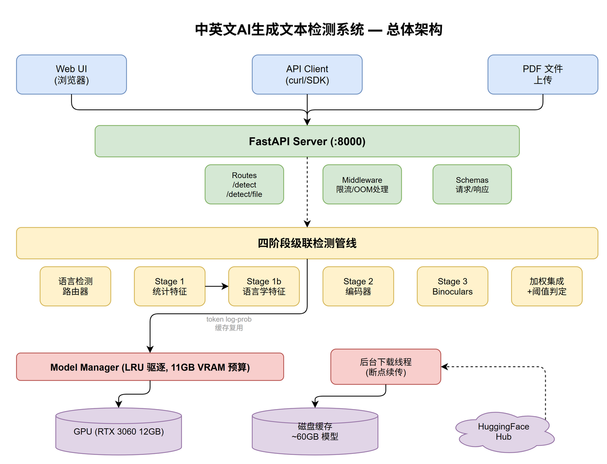

系统采用四阶段级联检测管线，每个阶段提供独立的AI生成概率评估，最终通过加权集成输出综合判定。

### 2.2 核心模块说明

#### 2.2.1 统计特征提取器（Stage 1）

使用参考语言模型（英文：GPT-2-XL，中文：Wenzhong-GPT2-110M）计算输入文本的以下特征：

| 特征 | 说明 |
|---|---|
| 困惑度（Perplexity） | 文本对参考模型的"意外程度"，AI文本通常更低 |
| 平均熵（Avg Entropy） | token预测分布的平均不确定性 |
| 熵标准差（Std Entropy） | 不确定性波动，AI文本波动更小 |
| 爆发度（Burstiness） | 熵的标准差/均值比，人类文本更高 |
| 最大熵（Max Entropy） | 最高不确定性token的熵值 |
| 最小熵（Min Entropy） | 最低不确定性token的熵值 |

特征通过XGBoost分类器转化为AI生成概率（p_ai）。

#### 2.2.2 语言学文体检测器（Stage 1b）

纯CPU运行的14维文体特征引擎，分三个层级：

**微观层（句子级，9个特征）：**
- 句长爆发度/变异系数/基尼系数（M1-M3）
- 句首token句法重复率（M4，Jaccard相似度）
- Token对数概率偏度/高频比例（M5-M6，复用Stage 1缓存）
- 模糊限制语密度（M7，中英文双语词汇表）
- 话语模板标记密度（M8）
- 标点风格评分（M9）

**中观层（段落级，2个特征）：**
- 段落长度方差（S1）
- 段落模板评分（S2，检测"背景→方法→结果→结论"模板）

**宏观层（全文级，3个特征）：**
- 词汇多样性MTLD（D1）
- 作者立场密度（D2）
- 可读性指数（D3）

#### 2.2.3 编码器分类器（Stage 2）

基于预训练语言模型的LoRA微调分类器：
- 英文：microsoft/deberta-v3-large + LoRA (r=16)
- 中文：hfl/chinese-roberta-wwm-ext-large + LoRA (r=16)

输出二分类概率（AI生成 vs 人类撰写）。

#### 2.2.4 Binoculars检测器（Stage 3）

零样本交叉困惑度检测，使用观察者模型和表演者模型的困惑度比值：
- 英文：tiiuae/falcon-7b + falcon-7b-instruct
- 中文：Qwen/Qwen2-7B + Qwen2-7B-Instruct

模型以4-bit量化加载，单卡显存占用约9GB。

#### 2.2.5 加权集成器

将各阶段结果按语言特异性权重融合：

```python
# 英文权重（语言学主导）
en_weights = {"linguistic": 0.85, "statistical": 0.15, "encoder": 0.0, "binoculars": 0.0}

# 中文权重（编码器主导）
zh_weights = {"linguistic": 0.10, "statistical": 0.10, "encoder": 0.60, "binoculars": 0.20}
```

权重系统支持动态归一化：当某些阶段不可用时，自动调整剩余权重至总和为1.0。

### 2.3 语言特异化设计


系统对中文和英文采用不同的决策路径：

| 决策点 | 英文 | 中文 |
|---|---|---|
| Stage 1早期退出 | 置信度>0.99时允许 | **禁止**（防止误判正式文本） |
| Stage 1&2一致时跳过Binoculars | 是 | **否**（始终运行Stage 3） |
| 仲裁块 | 无 | 统计判"人类"但编码器p_ai≥0.35时，使用编码器单独决策 |
| 决策阈值 | 0.50 | 0.47 |

---

## 三、运行环境

### 3.1 硬件要求

| 配置 | 最低要求 | 推荐 |
|---|---|---|
| GPU | NVIDIA RTX 3060 12GB | NVIDIA RTX 4090 24GB |

> **注：** 最低配置（12GB）下，Binoculars 以 4-bit 量化运行，当显存不足时部分模型会被 LRU 策略驱逐。系统以降级模式运行（不含被驱逐的阶段），功能完整但检测精度降低。
| 内存 | 16GB | 32GB |
| 存储 | 60GB（模型缓存） | 100GB SSD |

### 3.2 软件环境

| 组件 | 版本 |
|---|---|
| Python | ≥ 3.12 |
| CUDA | ≥ 12.0 |
| PyTorch | ≥ 2.4 |
| transformers | ≥ 4.46 |
| FastAPI | ≥ 0.115 |
| bitsandbytes | ≥ 0.43 |

### 3.3 模型依赖

| 用途 | 模型 | 大小 |
|---|---|---|
| 英文统计特征 | GPT-2-XL | 6GB |
| 中文统计特征 | Wenzhong-GPT2-110M | 0.5GB |
| 英文编码器 | DeBERTa-v3-large + LoRA | 1.5GB |
| 中文编码器 | Chinese-RoBERTa-wwm-ext-large + LoRA | 1.3GB |
| 英文Binoculars | Falcon-7B + Falcon-7B-Instruct | 28GB |
| 中文Binoculars | Qwen2-7B + Qwen2-7B-Instruct | 28GB |
| 语言检测 | XLM-RoBERTa-base | 1GB |

模型在首次启动时通过后台线程自动下载。下载过程中断后，通过 `.incomplete` 文件检测支持从中断处恢复，无需重新下载。

---

## 四、功能说明与界面操作演示

本节以软件实际运行界面为准，按操作流程逐项演示软件全部功能。以下截图均取自本系统V1.0在本机部署环境下的真实运行画面。

### 4.1 软件功能与截图对照总表

| 申请表声明功能 | 对应界面截图 | 操作章节 |
|---|---|---|
| Web前端（双模式界面与健康检查） | 截图1、截图2、截图7 | 4.2、4.5 |
| 四阶段级联检测管线 | 截图4、截图5（各阶段分数卡） | 4.3、4.4 |
| 统计特征提取 | 截图5（Statistical阶段卡片） | 4.4 |
| 语言学文体检测 | 截图5（Linguistic阶段卡片） | 4.4 |
| 编码器分类 | 截图4（Encoder阶段卡片） | 4.3 |
| Binoculars零样本检测 | 截图4、截图5（阶段分数区，按语言路径与显存策略动态参与集成） | 4.3、4.4 |
| 加权集成判定 | 截图4、截图5（综合判定徽章与置信度） | 4.3、4.4 |
| 文件上传检测 | 截图6、截图7 | 4.5 |
| 分段检测 | 截图4、截图5（Segment Analysis） | 4.3、4.4 |
| 后台模型下载 | 4.7节启动日志（降级模式与后台下载说明） | 4.7 |

### 4.2 Web前端主界面与服务健康检查（截图1、截图2）

浏览器访问 `http://localhost:8000` 进入Web检测前端。界面顶部为Quick Test Panel（快捷测试面板），提供"Check Service Health"健康检查按钮与四个内置示例（英文人工/英文AI风格/中文人工/中文AI风格），可一键载入示例文本；中部为输入区，通过"粘贴文本/上传文件"两个模式标签切换输入方式；"Include segment-level analysis"复选框控制是否启用分段检测。

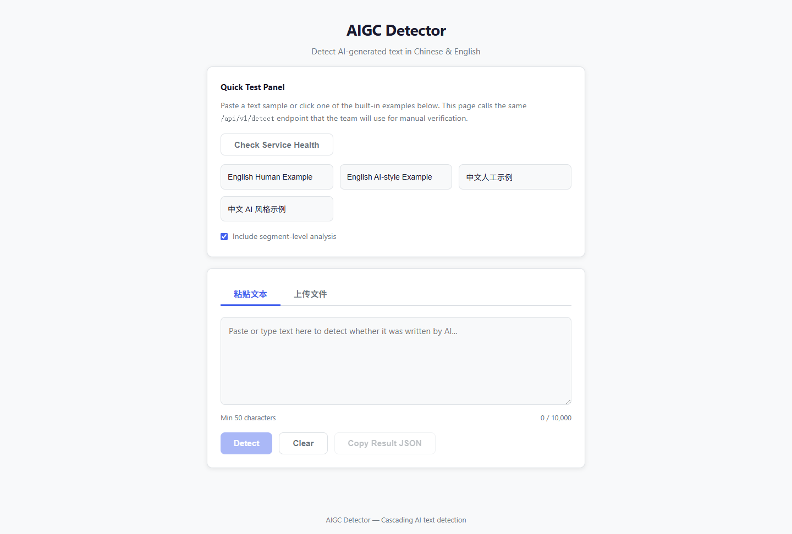

界面顶部的“Check Service Health”按钮用于实时查看服务运行状态。点击该按钮后，界面显示Status（服务状态）、Loaded（已加载模型列表）、GPU（显存占用）三组状态标签（截图2），可确认服务可用性与模型加载情况。

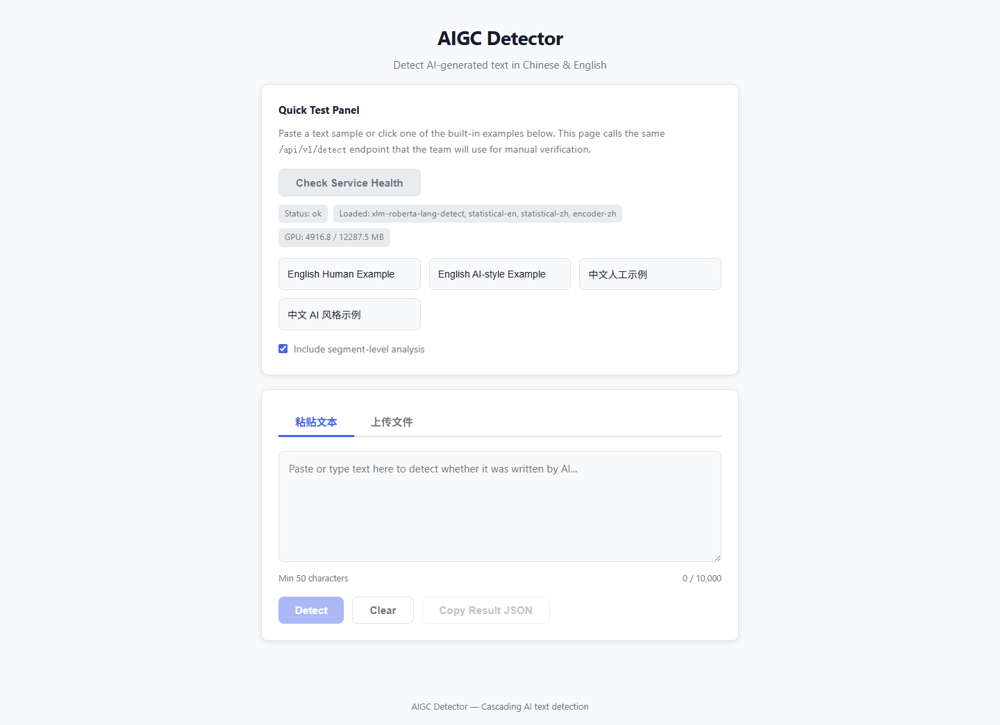

### 4.3 中文文本检测：编码器分类与分段检测（截图3、截图4）

操作步骤：①点击示例按钮"中文 AI 风格示例"，示例文本自动填入输入框，系统自动识别文本语言为中文；②勾选"Include segment-level analysis"启用分段检测；③点击"Detect"按钮开始检测。

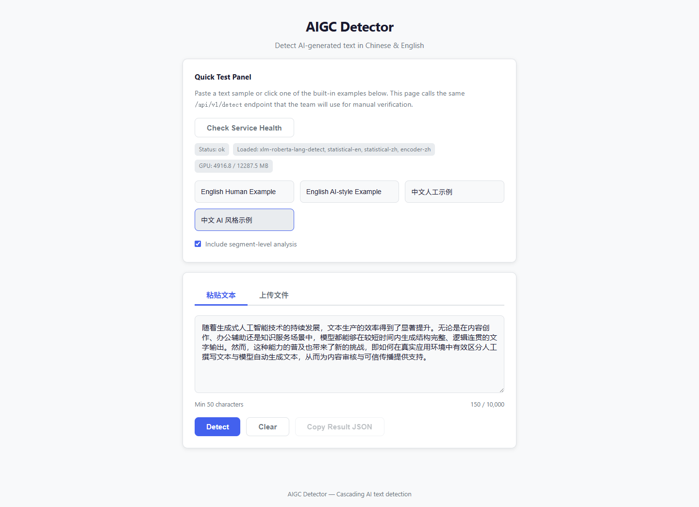

检测结果如截图4所示：综合判定徽章显示**AI-generated（置信度99.9%）**，即系统以中文路径（编码器主导加权）判定该文本为AI生成；阶段分数区显示Encoder阶段卡片（p_ai=0.9985，模型hfl/chinese-roberta-wwm-ext-large），体现编码器分类与加权集成判定功能；页面下方Segment Analysis区将文本按句子边界分为2个段落并逐段给出独立判定（Segment #0：AI-generated，置信度99.9%），体现分段检测功能；结果区同时提供Raw JSON Response折叠面板，可查看完整API返回报文。

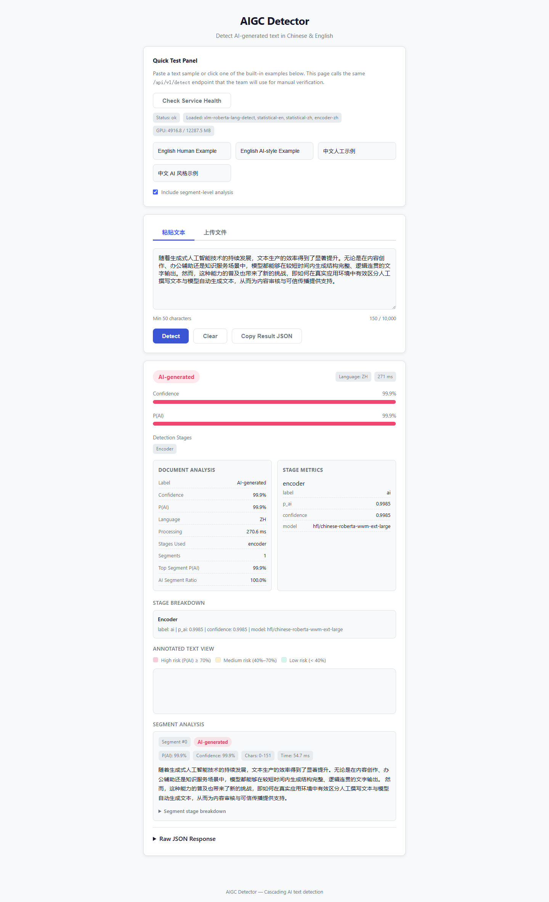

### 4.4 英文文本检测：统计特征与语言学文体分析（截图5）

操作步骤：点击"Clear"清空后，载入"English AI-style Example"示例并点击"Detect"。系统自动识别语言为英文并路由至英文检测路径（统计+语言学主导加权）。

结果如截图5所示：综合判定**Human-written（置信度90.4%，P(AI)=9.6%）**——该示例为人工仿写AI风格的英文文本，系统正确识别其出自人类之手，体现双向判别能力；阶段分数区显示Statistical阶段卡片（困惑度、熵分布等统计特征经XGBoost分类器输出p_ai=0.0005）与Linguistic阶段卡片（14维文体特征输出p_ai=0.1127），分别体现统计特征提取与语言学文体检测两项功能；页面底部Segment Analysis对多个分段逐段展示判定结果。

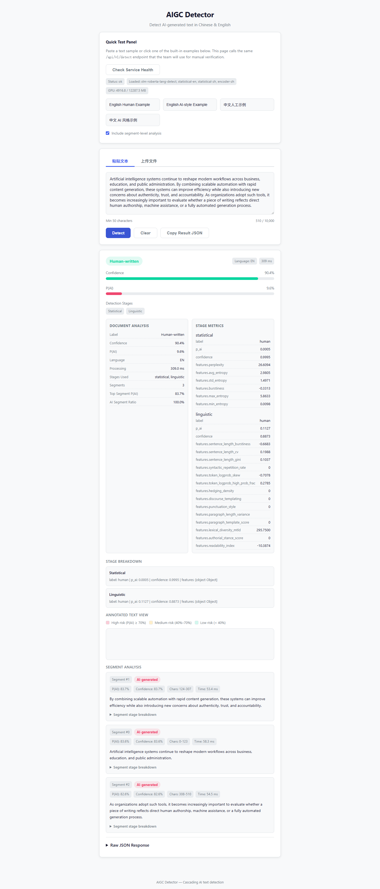

### 4.5 文件上传检测（截图6、截图7）

操作步骤：①点击"上传文件"标签切换至文件模式；②点击虚线拖拽区选择PDF/TXT/MD文件（或直接拖入），系统即提取文件文本内容并显示已提取字符数；③点击"开始检测（Detect）"运行检测。

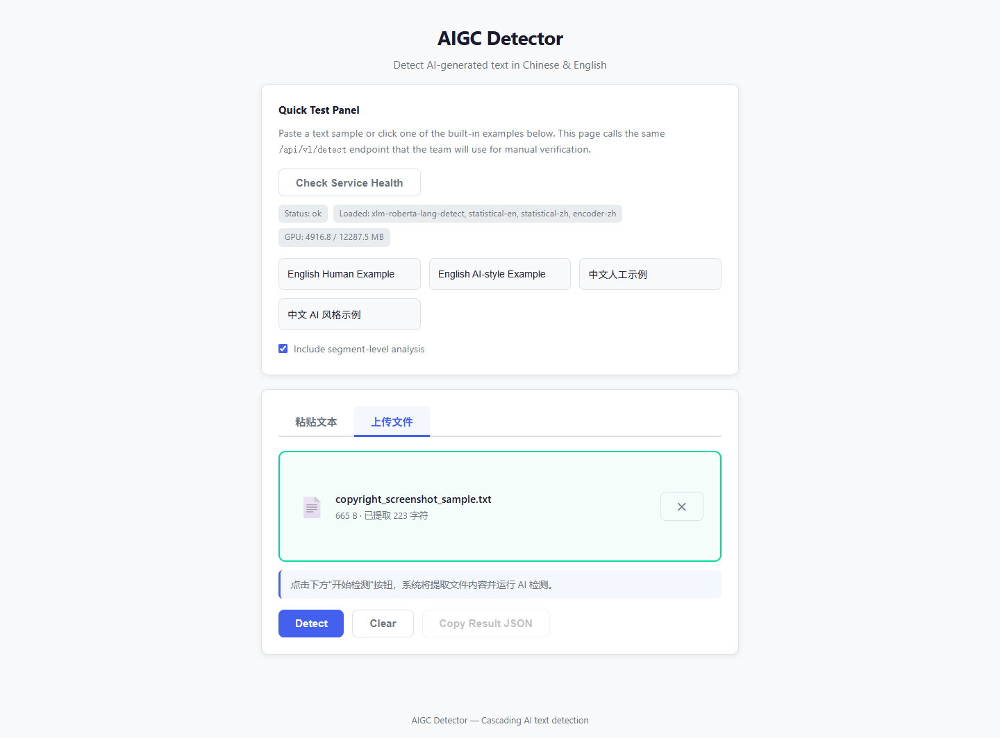

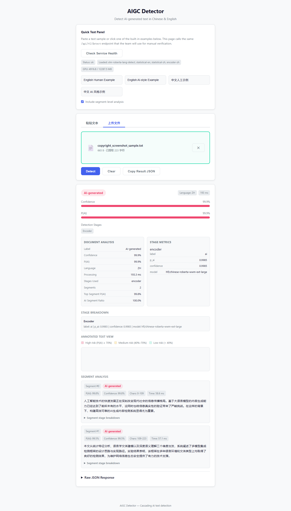

### 4.6 RESTful API服务与在线接口文档（截图8、截图9）

系统通过FastAPI提供RESTful API服务，核心端点如下：

| 端点 | 方法 | 功能 |
|---|---|---|
| `/api/v1/detect` | POST | 文本检测（JSON请求体：text、include_segments、include_diagnostics） |
| `/api/v1/detect/file` | POST | 文件检测（multipart/form-data，支持PDF/TXT/MD，≤20MB） |
| `/api/v1/health` | GET | 健康检查（返回状态、已加载模型、GPU显存占用、运行时长） |

访问 `/docs` 打开Swagger UI交互式接口文档（截图8），可查看全部端点的请求/响应Schema并在线调试；访问 `/redoc` 打开ReDoc参考文档（截图9）。

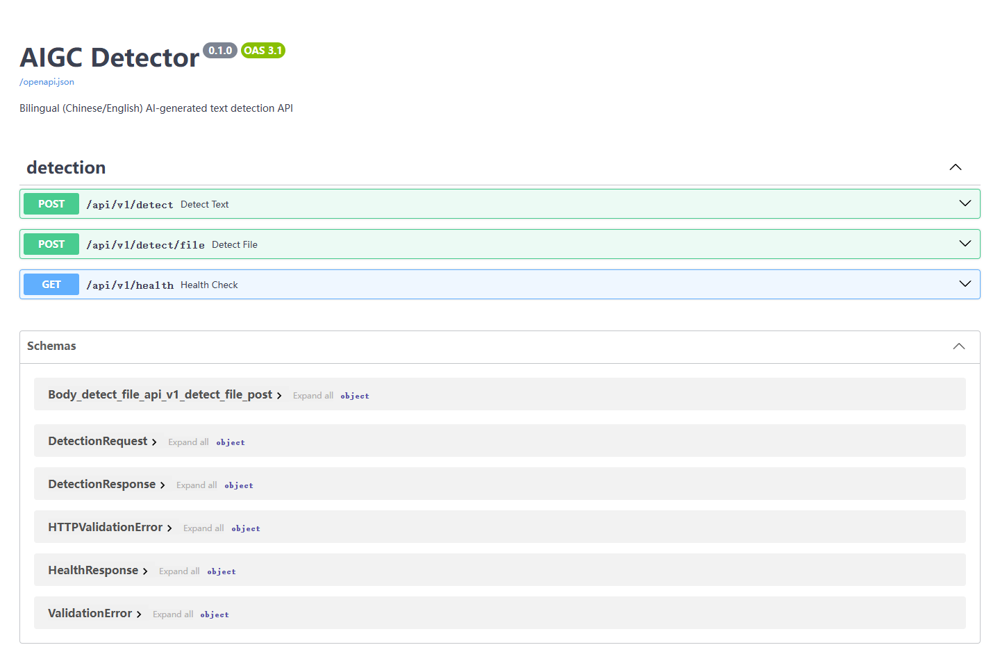

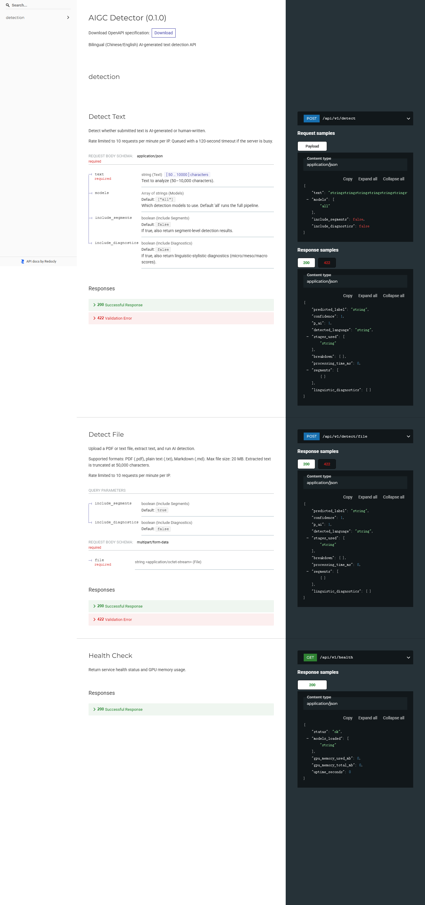

### 4.7 服务启动与后台模型下载

```bash
uv run uvicorn src.aigc_detector.api.main:app --host 0.0.0.0 --port 8000
```

服务启动时依次完成：加载语言检测与各检测阶段模型至GPU；对未就绪的Binoculars大模型启动后台下载线程（支持断点续传）；下载完成前服务以降级模式运行（其余阶段正常检测），模型就绪后自动并入集成。启动日志示例（真实运行输出摘录）：

```text
INFO:     Started server process [57516]
INFO:     Waiting for application startup.
XLMRobertaForSequenceClassification LOAD REPORT from: papluca/xlm-roberta-base-language-detection
INFO:     Application startup complete.
INFO:     Uvicorn running on http://127.0.0.1:8000 (Press CTRL+C to quit)
[Binoculars BG] Skipping en: incomplete download
```

### 4.8 分段检测说明

对长文本按句子边界分割为最多8个段落，每个段落独立运行检测管线并输出独立的AI生成概率与置信度，展示文本中AI生成概率的空间分布（见截图4、截图5的Segment Analysis区）。

---

## 五、使用说明

### 5.1 安装

```bash
# 克隆代码库
git clone <repository_url>
cd AIGC_Detector

# 安装依赖
uv sync
```

### 5.2 启动服务

```bash
# 启动API服务（默认端口8000）
uv run uvicorn src.aigc_detector.api.main:app --host 0.0.0.0 --port 8000
```

首次启动时，系统会：
1. 加载已缓存的模型到GPU
2. 对未缓存的Binoculars模型启动后台下载线程
3. 服务以降级模式运行（不含Binoculars），下载完成后自动激活

### 5.3 预下载模型（可选）

```bash
# 检查缓存状态
uv run python scripts/prefetch_binoculars.py --check

# 预下载所有Binoculars模型
uv run python scripts/prefetch_binoculars.py
```

### 5.4 运行测试

```bash
uv run pytest tests/ -q
```

### 5.5 模型训练

```bash
# 训练编码器LoRA
uv run python scripts/train_encoder.py --lang zh

# 训练统计分类器
uv run python scripts/train_statistical.py --lang zh

# 训练语言学分类器
uv run python scripts/train_linguistic.py --lang zh --features <features.jsonl>
```

---

## 六、性能指标

### 6.1 检测准确率

| 数据集 | 语言 | 准确率 | AI召回率 | 人类召回率 | 评估口径 |
|---|---|---|---|---|---|
| HC3-Chinese (hold-out) | 中文 | 97.0% | 100% | 93.8% | 随机100条不重复样本 |
| 教材文本 (hold-out) | 中文 | 100% | 9/9 | — | 9条不重复样本 |
| 完整章节泛化 | 中文 | 100% | 6/6 | — | 3000字符/章，不同于训练长度 |
| Defactify EN | 英文 | 90.4% | 88.2% | 92.3% | 710条全量测试 |

### 6.2 领域自适应

针对现代LLM（GPT-4/Claude）中文教材内容的检测改进（10倍过采样持续学习）：

| 指标 | 优化前 | 优化后 | 评估口径 |
|---|---|---|---|
| 教材唯一样本召回率 | 0/9 (0%) | 9/9 (100%) | 9个不重复hold-out |
| 完整章节泛化召回率 | 0/6 (0%) | 6/6 (100%) | 3000字符/章 |
| HC3准确率 | — | 97.0% | 100条随机样本 |

### 6.3 推理延迟

| 场景 | 延迟 |
|---|---|
| 统计+语言学（Stage 1+1b） | ~200ms |
| + 编码器（Stage 2） | ~500ms |
| + Binoculars（Stage 3） | ~2000ms |
| 完整四阶段 | ~2500ms |

---

## 七、项目结构

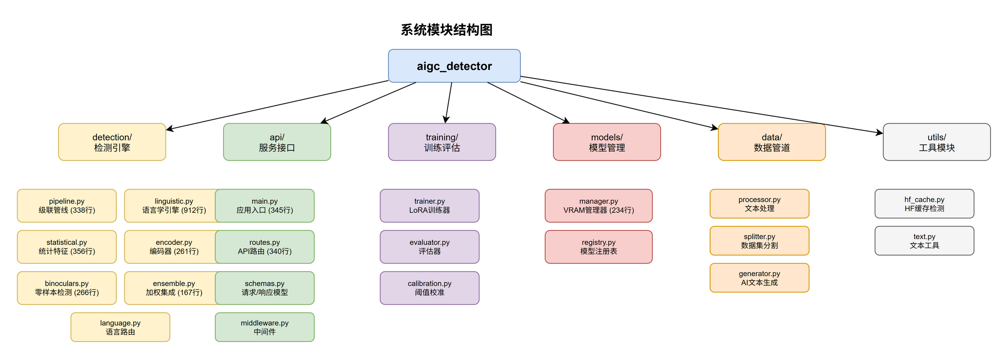

```
AIGC_Detector/
├── src/aigc_detector/
│   ├── api/              — FastAPI路由、中间件、Schema
│   ├── detection/        — 检测管道（统计/编码器/Binoculars/集成/语言学）
│   ├── training/         — 模型训练、评估、校准
│   ├── data/             — 数据处理、爬取、生成、分割
│   ├── models/           — 模型管理、注册表
│   ├── utils/            — 日志、文本工具、HF缓存
│   └── config.py         — 配置加载
├── configs/              — YAML配置文件
├── scripts/              — 训练、评估、数据生成脚本
├── tests/                — pytest测试（263个用例）
├── static/               — Web前端（HTML/CSS）
├── docs/                 — 文档
├── qa/                   — QA检查清单
└── pyproject.toml        — 项目配置
```

---

## 八、版权声明

本软件由开发团队独立设计和实现，包含以下核心技术创新：

1. **语言感知四阶段级联检测管线** — 中文和英文采用不同的决策路径、提前退出策略和仲裁规则
2. **14维双语语言学文体特征引擎** — 纯CPU运行的Micro/Meso/Macro三层特征体系，与LM概率正交
3. **过采样持续学习领域自适应** — 用百级样本实现新领域适配，通过双轨回归验证保证不遗忘旧领域

其余工程实现（LRU显存管理、后台模型下载、阈值校准等）为标准工程实践。

所有源代码均为原创，未使用任何第三方专有代码。
